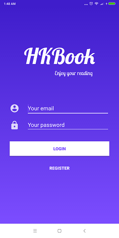
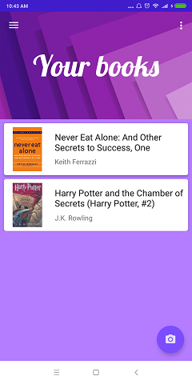
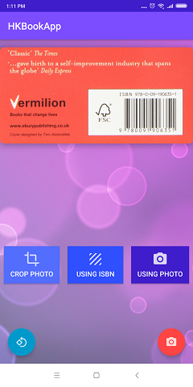
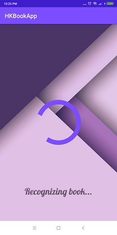
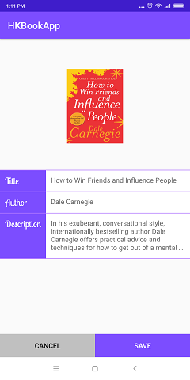

# HKBook Android Application
This is a school project for a Goodreads-like application. This application helps users to recognize books from their covers or ISBN code. It uses Microsoft Azure Vision API for text recognition and Goodreads API for getting book informations. It also provides book management using Firebase Realtime Database.
## Core features
* Recognize book from cover
* Recognize book from ISBN
* User sign in/sign out
* Book management
* Recognize author from photos
## Build the application
* Clone the project
* Enter Microsoft Azure subscription key in strings.xml
* Enter Goodreads developer key in BookRequestHelper.java
* Create a project on Firebase and connect to this project
* Build the app
## App's Photo
    